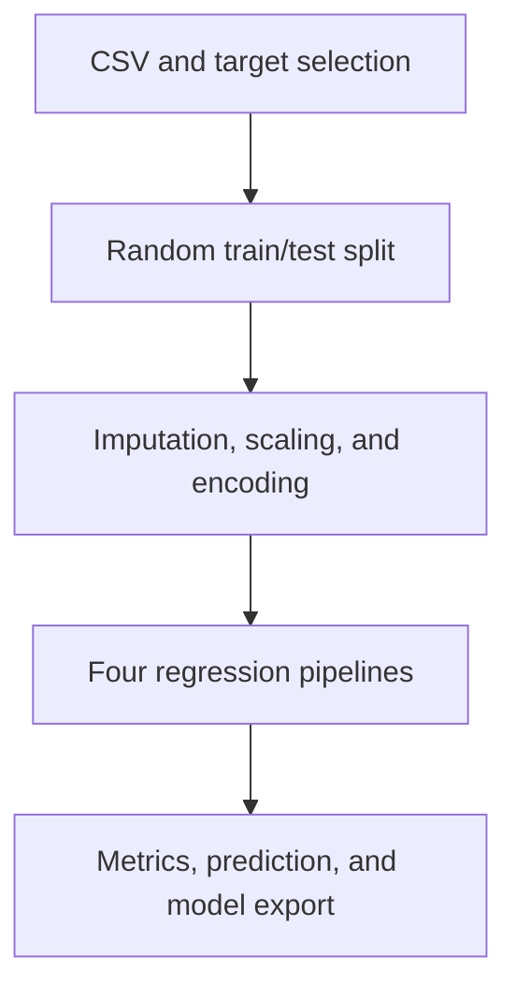

# Business Intelligence Forecaster

A Python desktop application for exploring CSV data, comparing regression pipelines, and making predictions from numeric and categorical inputs.

## Overview

The application brings data inspection, preprocessing, model comparison, and single-record prediction into a Tkinter interface. Despite the historical repository name, the current implementation performs **tabular regression** with a random train/test split. It does not implement chronological forecasting, Prophet, ARIMA, or rolling time-series validation.

## Key features

- Load a CSV and inspect columns, missing values, data types, and numeric summaries.
- Select a numeric target and configure the held-out test percentage.
- Impute and standardize numeric features; impute and one-hot encode categorical features.
- Compare Linear Regression, Ridge, Lasso, and Gradient Boosting.
- Display 5-fold cross-validation RMSE and test RMSE, MAE, and R².
- Plot feature importance or absolute coefficients for the selected model.
- Predict from manually entered feature values and save/load a fitted pipeline.

## Architecture



`BusinessIntelligenceForecaster` contains data/model operations. `BIForecastGUI` provides the Data, Model, and Predict tabs. Both are currently implemented in [BIF.py](BIF.py).

**Stack:** Python · pandas · NumPy · scikit-learn · Matplotlib · seaborn · Tkinter.

## Methodology and limitations

Preprocessing lives inside each scikit-learn Pipeline, including cross-validation. Unknown categorical values are ignored by the encoder. The default test split is 20% with seed 42.

The app selects the model with the highest **test-set R²**. This uses the held-out test set for model selection, so its displayed scores are exploratory, not an unbiased final evaluation. A future improvement is to select by cross-validation and retain a separate untouched test set.

There is no committed business dataset or benchmark result. Training runs synchronously on the GUI thread, so the window may pause while fitting. Use a small dataset for a first run. Model pickle files should only be loaded from a trusted source.

## Getting started

Use Python 3.12 with Tkinter support:

```bash
git clone https://github.com/minhiungan2608/Business-Intelligent-Forcaster.git
cd Business-Intelligent-Forcaster
python -m venv .venv
source .venv/bin/activate
python -m pip install -r requirements.txt
python BIF.py
```

On Windows, activate with `.venv\Scripts\activate`. Check Tkinter availability with `python -m tkinter`; some Linux Python installations require a separate Tk package. A graphical desktop is required to open the app.

### Example workflow

1. Load [examples/demo.csv](examples/demo.csv).
2. Select `sales` as the target and leave the test size at 20%.
3. Click **Prepare Data**, then **Train Models**.
4. Review the model metrics.
5. In Predict, enter values for `ad_spend`, `visitors`, and `channel`.

The demo CSV is generated synthetic data for checking the workflow. Its scores do not measure real business forecasting performance.

### Use the core class without a GUI

```python
from BIF import BusinessIntelligenceForecaster

app = BusinessIntelligenceForecaster()
ok, message = app.load_data("examples/demo.csv")
assert ok, message
ok, message = app.prepare_data("sales")
assert ok, message
ok, result = app.train_models()
assert ok, result
print(result["best_model"])
ok, prediction = app.predict(
    {"ad_spend": 250.0, "visitors": 500, "channel": "search"}
)
assert ok, prediction
print(prediction)
```

## Repository structure

| Path | Purpose |
|---|---|
| `BIF.py` | Modeling core and desktop interface |
| `requirements.txt` | Python dependencies |
| `examples/demo.csv` | Synthetic demonstration data |

The modeling core has been smoke-tested on the synthetic example through load, prepare, train, predict, and save/load. The desktop interaction has not been visually verified during the documentation pass. No repository-wide software license has been specified.
